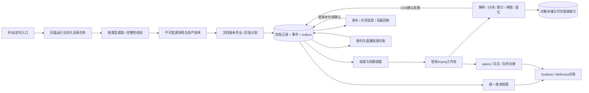
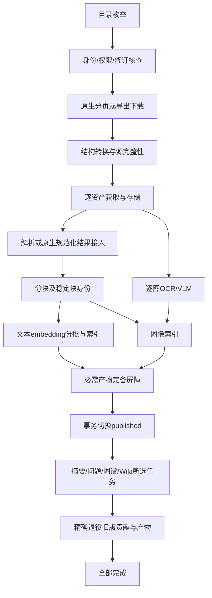

# 腾讯文档同步、文档生命周期与阶段重试重设计

状态：**待实施的设计契约**，2026-09-10；适用上游WeKnora v0.7.2、主项目 `weknora-v0.7.2`。不是已部署功能或生产迁移脚本。

**核心决策：用数据库中有代次、有输入产物、有租约的阶段记录驱动执行和重试；Dashboard展示同一份记录。** 保留Asynq、PostgreSQL、对象存储、现有工作池及Wiki待办能力。修复点放在同步与处理的共享入口，不再给每一种错误各加一条恢复脚本。

依据：[当前架构与历史复审](2026-09-10-tencent-sync-review.md)。最小验收模型：[model_check.py](model_check.py)。模型验证状态不变量，**不代表生产代码已经实现阶段重试**。

## 1. 必须成立的业务约束

1. “已提交”“排队”“运行”“等待外部服务”“等待重试”“失败”“已发布”“全部完成”含义不同，禁止互相代替。
2. 完整读取才产生可消费的源快照；缺页、缺字段、缺图片、未知块、版本混合、超限都不能静默转成成功。
3. 只有当前期望代次能够发布。旧版在新版本达到发布门槛前持续可用；失败重试不会先删除可用版。
4. 源快照、分块、图片结果、索引批次等产物经过指纹和checksum校验后可复用。摘要失败不重抓源、不重跑DocReader、不重做文本embedding。
5. 一次阶段终态只确认一次；队列重复投递、回调重复、旧轮次迟到、重启均不得重复扣减或污染当前结果。
6. 原始错误和后续恢复均可追溯；不靠删除错误、改时间戳或标题匹配消警。
7. 观测查询失败表示未知。不能因为Redis、spans或日志查询不可用，就把业务任务标失败或重新启动非幂等操作。
8. 源目录相对路径、租户隔离、选择范围、FAQ append/merge及“源删除不自动删知识”的既有约定保持有效。

“完整兼容”在这里指完整保留知识库需要的正文、结构关系、引用与所选媒体处理结果。编辑器像素级版式、交互式视图和自动化行为分别列入能力矩阵，不用纯文本入库成功冒充这些能力。

## 2. 目标架构与职责



| 模块 | 负责 | 对调用者提供的结果 |
|---|---|---|
| 腾讯源适配 | 类型、身份、分页、导出、原生结构与资源完整性 | 已验证的快照引用；或带阶段/工具/错误类别的结果 |
| 生命周期协调 | 固定代次、建立阶段计划、验收依赖、发布门槛 | 可恢复job/step，不阻塞等待整份文档 |
| 阶段执行 | 基于固定输入完成一个阶段或一个工作单元 | 产物引用、统计、错误或外部等待信息 |
| 投递/对账 | outbox交付、到期重试、租约接管 | 确定的投递/执行证据，不推测内容质量 |
| 观测投影 | 同一账本的当前状态、历史、计数、关联 | 只读视图；操作走WeKnora鉴权接口 |

腾讯平台MCP消费适配仍位于主项目数据源代码。若确需修改WeKnora对外MCP Server的协议、认证或租户路由，另在 `weknora-mcp-dispatch/weknora-v0.7.2` 实施；此次设计不把两类仓库混用。

## 3. 四种身份与最小持久化模型

### 3.1 身份不能合并

- `run_id`：一次扫描请求。来源为手动、定时或核查；重试不创建一个看似全新成功的扫描来覆盖前一次失败。
- `logical_key`：`tenant_id + knowledge_base_id + datasource_id + external_id`。external_id沿用空间/个人节点身份；canonical_file_id另存，不能因共享底层文件而丢失原选定路径和来源隔离。
- `job_id / generation`：该逻辑文件的一份源版本与处理计划。源版本或影响输入的配置改变才建立新代次；重投不自动开新代次。
- `step_id / step_attempt / dispatch_seq / lease_token`：具体阶段单元、业务尝试、投递序号和本次执行所有权。每一个异步payload都必须带齐。

**current与published是两个独立指针语义**：current是当前期望处理的代次，published是对用户生效的版本；失败时两者可以指向不同job。不能从最新completed或enable_status反推它们。

### 3.2 持久化记录

复用现有 `sync_logs` 作为run入口及兼容汇总，复用 `task_pending_ops` 作为outbox；增加下列记录。前三张保存执行事实，第四张仅保存扫描与作业的关联，避免同一job被多个扫描重复计数。

| 表 | 必需字段与约束 |
|---|---|
| `processing_jobs` | id、kind(scan/document)、完整logical_key、origin_run_id、generation、scope_revision、auth_revision、source_revision、source_digest、pipeline_fingerprint、candidate_knowledge_id、is_current、is_published、publication_epoch、active_index_manifest、rollback_pin、retirement_state、completeness、readiness、lifecycle_status、revision、发布/终态时间 |
| `processing_steps` | id、job_id、parent_step_id、stage、unit_key、kind(work/barrier)、status、step_attempt、dispatch_seq、lease_token、lease_expires_at、heartbeat_at、progress_at、input_fingerprint、expected_publication_epoch、checkpoint_ref、output_manifest_ref/digest、plan_sealed、plan_digest、expected_units、required_for_ready、required_for_completion、retry_count/max_retries、next_run_at、deadline_at、error_class/code、最后错误事件ID、queued/started/finished时间 |
| `processing_events` | 单调事件ID；job_id、job_revision、run_id、step_id、generation、attempt、dispatch_seq、lease_token、from/to、event_type、error_class/code、脱敏摘要、actor、action、operation_request_id、queue_task_id、trace_id、发生时间、resolves_event_id及resolution_type |
| `sync_run_items` | run_id、item_key、kind、external_id、job_id、disposition(new/changed/unchanged/reused/missing/skipped)、source_revision、discovered_at；唯一(run_id,item_key)。不独立写文档执行状态，关联job投影 |

`processing_jobs.kind=scan`拥有目录枚举阶段；文件任务关联document job。这样尚未创建knowledge的目录/抓取失败也可追踪。一个未完成文档job可以被新run关联，而不重复抓取和重置重试预算。

必要约束：

```sql
-- 示意约束；实施时由版本迁移建立，不在生产直接运行。
UNIQUE (tenant_id, knowledge_base_id, datasource_id, external_id, generation)
UNIQUE (job_id, stage, unit_key)
UNIQUE (run_id, item_key)
-- logical_key上分别建立 WHERE is_current AND kind='document'
-- 与 WHERE is_published AND kind='document' 的两个唯一索引。
-- outbox的业务投递键唯一：(step_id, step_attempt, dispatch_seq)。
-- 事件顺序唯一：(job_id, job_revision)。
-- 有operation_request_id的操作事件按(tenant_id, action, operation_request_id)唯一。
```

首次创建job、分配generation、切current/published使用同一把稳定锁。第一版直接在短事务里锁已有data_sources行，避免“首个current不存在，锁不到行”的竞态；不得持锁做网络/LLM/下载。实测吞吐不足时再换完整logical_key的事务advisory lock。多副本不能继续依靠进程内map锁。

事件、阶段迁移和后续outbox在同一事务提交。spans、parse_status、sync_logs统计、Redis缓存均是可重建投影；spans写失败不能改变执行事实。迁移期间每个job只能有一个状态写入协议，不能同时由旧计数器和新账本决定终态。

现有task_pending_ops需为生命周期投递增加可为空的step_id、step_attempt、dispatch_seq、available_at及投递确认字段，并对非空业务投递键建立唯一约束；原Wiki待办不受该约束误伤。使用独立的outbox操作类别，避免被原Wiki业务消费者当作贡献操作领取。记录claim与实际queue_task_id确认，消费成功后历史由events保留；不把现有非唯一DedupKey误当幂等保障。

## 4. 生命周期、完成门槛与状态机

### 4.1 阶段计划



具体工作单元：目录=folder/page；DOC=结构页/表格/图片；Sheet=子表范围；SmartCanvas=page/token slice；SmartSheet=表/字段页/记录页；embedding=batch；图片=稳定asset ID；graph=chunk contribution；Wiki=知识贡献及受影响页面；cleanup=旧版本产物组。

页级断点保存到快照manifest；只在必须独立调度时建立页级step，避免为一个短请求机械拆出大量任务。失败后至少能从该文档已确认的页/范围继续。

动态fan-out必须先登记计划，再封存 `plan_sealed + expected_units + plan_digest`。屏障只在计划已封存、实际登记数匹配、所有必需单元成功时开放。0个待办、Redis键不存在、没有返回图片，都不能单独证明完成。

封存计划显式区分`required_for_ready`和`required_for_completion`：源完整性、核心块与索引、已启用的必要图片索引计入ready；发布后的富化和旧版退役只计入completion，避免publish等待enrichment而enrichment又等待publish。OCR/VLM可在资产获取后并行，但图像索引确认还必须依赖稳定chunk/asset映射。

FAQ沿用独立分支：规范化表格 → 字段映射/标准问校验 → 候选FAQ索引 → 按标准问append/merge → 发布确认。格式错误只重试已修复输入之后的转换；不得按源“拥有”关系删除已有答案。

### 4.2 阶段执行状态

| 状态 | 含义与出口 |
|---|---|
| planned / enqueue_pending | 依赖未就绪，或已有持久计划等待投递；不能显示运行中 |
| queued | 收到实际队列交付确认；worker尚未获取lease |
| running | 正确payload获取有效lease，并记录真实started_at |
| waiting_external | 导出/解析平台明确仍在处理；按next_run_at继续核查，正常轮询不算错误重试 |
| retry_wait | 已记录确定的可重试失败，等待分钟级退避 |
| succeeded | 当前输入对应产物已验证，并事务确认 |
| blocked | 权限、超限、内容不完整、未知导出结果等，需要明确条件改变或人工核查 |
| failed | 已用完自动预算的确定失败；区别于从未执行的blocked |
| canceled / superseded | 用户取消、范围失效或更新代次取代；旧回调不能复活 |
| skipped | 有明确策略与证据的跳过，例如新文件验证为空、未启用的富化、明确排除类型 |

`observation_unknown`是观测质量，不写成业务终态。心跳回答“是否活着”，progress_at回答“是否推进”，lease回答“谁有权提交”，deadline回答“是否超出执行预算”，四者不能共用updated_at。

运行状态使用上表的闭合集合。文中的capacity_wait映射为`waiting_external + reason=capacity`；needs_review为`blocked + reason=needs_review`；blocked_reconcile为`blocked + reason=export_start_uncertain`；skipped_empty_source为`skipped + outcome=verified_empty`。不得把这些显示文案再扩成互不兼容的状态枚举。

### 4.3 文档与run的汇总

- `readiness=ready`：已满足该KB启用能力的核心检索门槛；源正文和资产完整性必须通过。若多模态未启用，图片引用仍须保留，OCR状态显示not_requested。
- `is_published=true`：事务已完成可见版本切换。不是全部处理完成。
- `lifecycle=succeeded`：所有已启用并计入本作业计划的阶段及旧版退役完成。已发布但摘要/Wiki失败显示“可检索，后处理失败/待重试”。
- `completeness=complete / verified_empty / incomplete / unknown`：独立于执行状态。unknown或incomplete不能开放发布屏障。
- 扫描未封存时显示“已发现N项，总数尚未知”；封存后run各文件计数来自sync_run_items关联的当前作业结果，不从100条错误样本推算。
- 目录完整且全部成员达到策略终态，run才结束；仍有retry_wait/active子作业则保持waiting。预算耗尽可为partial/failed；blocked明确单列。其他已就绪文件继续处理。
- 分别保存last_observed_revision、last_verified_snapshot、last_published_revision、last_completed_revision。增量发现可以不重抓已验证同修订，但失败的后处理仍由原job继续，不能因游标跳过而永远丢失。

run结束时追加不可变run_finished事件和当时计数快照。后续阶段恢复/人工操作更新“成员当前状态”并追加resolution，不改写原finished_at或历史结果；Dashboard分别展示当时结论与当前未解决数。

## 5. 原生文档读取与完整性设计

### 5.1 通用入口与身份

配置验证由“能列空间”升级为只读能力检查：按实际选中文档类型确认工具、参数schema、返回结构、权限和版本读取能力。保存adapter/schema版本与契约摘要，不在日志保存token或正文。文档正常metadata不能证明所有内容工具均有权限；本轮DOC的60007即为实例。

优先使用已配置官方MCP endpoint聚合暴露的工具；若工具仅位于官方独立DOC/Sheet endpoint，必须使用显式白名单配置和已核实的授权契约。不能采用响应中任意URL作为新MCP服务地址。当前schema与旧参考冲突时，以实测契约适配并锁定版本，未知变更进入CAPABILITY_CHANGED。

身份解析结果保存node_id、canonical_file_id、原访问URL、原选定范围和验证证据。官方返回明确映射才自动接受。没有可靠映射时为IDENTITY_UNRESOLVED；允许人工核实的映射登记并在使用前复核权限。**不能按同名搜索结果猜映射，也不能解析53044错误文字作为正常生产解析器。**

元数据明确为trash/deleted时按源移除策略分流，不能因为原生接口还能读历史块就当成当前有效文档。无权限、未知状态、该工具不支持元数据须分别分类；对已确认的资源文件保留受控导出路径。普通链接仅保留引用，不自动扩展到选定范围外的其他文档。

源修订能固定读取则固定；否则读前/读后核查修订、类型、结构清单，发现变化仅重建该文档快照。无版本读的before/after校验不是严格MVCC；高变动文档需额外稳定窗口/重复manifest核对，仍不稳定则SOURCE_CHANGED_DURING_READ，不拼接混合版本。

内容指纹使用稳定规范化内容、节点/字段/资产身份及校验结果，不包含trace、临时签名、请求时间等每次调用变化的字段。资产没有直接resource ID时保存可重定位的file/page/block定位信息；刷新临时地址后重新验证版本。私有快照中的引用规范化为资产身份，签名变化不能制造伪新版本。

### 5.2 类型适配矩阵

| 类型 | 首选与校验 | 不能采用的捷径 |
|---|---|---|
| DOC / word / tencentdoc | 完整正文来源 + `doc.resolve_document_structure(mode=2)` 分页 + 必要的表格/文本框/图片读取；或已验收的完整DOCX导出 | 把compact/full的text_preview当全文；text_preview_length=0实际是关闭预览；默认150节点不代表全文 |
| Sheet / excel / tencentsheet | `sheet.get_sheet_info`遍历子表；按范围读结构化cells，必要时include_formula=true | 通用get_content代替全表；遇空白页提前结束；把SmartSheet当Excel |
| SmartCanvas | 所有top-level pages逐页`smartcanvas.read(size<=20,next_token)`，核对节点ID并转换MDX | 只读第一页；改扩展名；用Word编辑引擎读SmartCanvas |
| SmartSheet | 全部tables → 全部fields → 全部records，显式计算值、ID与总数核对 | 只取默认表/第一个视图；默认100条；把筛选视图当全量 |
| resource / PDF / DOCX等附件 | 已保存导出意图 → 可恢复任务轮询 → 受限下载 → 原解析链路 | 元数据不支持就当文件不存在；未知导出开始结果盲目重发 |
| slide/form/mind/flowchart等 | 各自能力矩阵或已验证完整导出；不支持则明确策略跳过/阻塞 | 全部列为online后统一宣称get_content完整 |

DOC全文契约是实施门槛：设计阶段的旧业务样本未取得结构接口权限；9月10日新建的隔离合成DOC已取得结构数据，并通过真实DOCX导出与DocReader校验了长段落、表格、代码文本、脚注及图片。结构读取中的preview仍不能作为全文；文本框和其他结构须逐项验证。找不到完整读取路径时明确blocked，不能作已完全兼容的承诺。

### 5.3 分页与断点的统一约定

1. 首次请求记录源修订、page/range/field/table身份、参数摘要和期望范围。
2. 校验返回类型、业务error、分页标志、重复ID、范围和字节数。MCP IsError/JSON envelope/协议错误均归一为带tool+code+trace的错误。
3. 先把本页写入临时对象并验证checksum，再事务写本页已确认manifest引用和下一游标；成功前不能推进checkpoint。
4. token重复、has_more=true且无进展、next倒退、总数变化、重复/缺失记录都不能当结束。允许有预算的同页重新读取，不能自动跳页。
5. 所有分页封存后校验声明集合、读取集合、去重集合和资源清单。数量相等也必须校验稳定身份和范围，防止重复抵消缺失。
6. 游标失效时优先按同一固定版本的稳定ID/range恢复；不支持则仅重新读取该文档/子表并重核manifest，不重跑整个知识库。
7. 对无总数接口，保存每页接续链及结束证明；不能声称验证了服务端未提供的总数。枚举失败不触发删除检测。

普通Sheet保留现有“每次最多20,000单元格，偏好100行”；绝对/相对行坐标按已验收返回契约归一，歧义明确失败。仅过滤完全零值占位对象，NUMBER=0、BOOL=false、公式都是真值。used_range若有且已验证可缩小物理扫描范围，缺失时退回声明网格尺寸；空行仍属于覆盖范围。

子表也要核对sheet_type：混合文档中的smartcanvas/smartsheet子页不能强行按worksheet坐标读取；使用经过验收的子类型定位和接口，缺少该契约则明确blocked。隐藏但仍处于授权范围的子表不能因显示状态被静默略过。

SmartSheet字段分页和记录分页都执行；`include_computed_values=true`用于所需计算列。字段ID是身份，标题是显示名；重名标题不能覆盖数据，若记录工具只按标题回值且无法消歧则blocked。保留文本、数字精度、布尔、日期时区、单/多选、人员/引用显示值、附件身份、公式/查找计算值及错误状态。未知字段类型保留原结构产物并列入unsupported，不能当空值。视图排序只决定展示顺序，不得无意继承筛选造成数据漏读。

### 5.4 MDX转换与资产

使用受限语法解析器处理腾讯已公布的MDX组件，不执行JS、import、表达式或任意组件；不要靠正则删除标签。优先复用现有Markdown语法库，组件语法仅支持已声明的字符串/布尔属性及嵌套结构。

| 原生结构 | 入库语义 |
|---|---|
| Heading、Paragraph、Mark | 标题级别、段落边界、行内文本；保留必要强调 |
| BulletedList、NumberedList、Todo | 嵌套和顺序、显式完成状态；完成状态同时可表达为可检索文本 |
| Table/Row/Cell、合并单元格 | 明确行列/表头/合并关系；复杂表保存结构JSON并生成可读文本，不能拼成无分隔字符串 |
| Callout、BlockQuote、ColumnList/Column | 提示/引用文本和稳定阅读顺序；布局不等同正文结构丢弃 |
| Link、Image、附件 | 文字、目标身份、位置、资源manifest；带权限的图片经现有受控下载/存储处理 |
| 代码、Unsupported、未知组件 | 完整代码保留语言与内容；Unsupported只证明缺口，必须补读验证或blocked |

48张图片用稳定asset ID全部登记；当前30张阈值改为**每批工作预算**，不是整份文档静默截断点。单图失败只重试该资源/处理单元。过期签名地址不进入任务payload、事件或持久重试输入，重试以provider资源ID/原始版本重新取临时地址。

实施期真实验证补充：腾讯图片CDN在缺少来源头时返回403；携带公开的`Referer: https://docs.qq.com/`后，48张合成图片共547,533字节全部下载，逐图SHA256与上传前一致。这里只传公开来源，不传文档地址、Cookie或MCP凭据。MDX读取返回的`\<Page>`等转义文本必须在组件分词前保留为正文，不能误识别为节点或图片。本次编辑接口把`Page`包装写成了字面文本，因此该真实样本证明的是一个顶层页的多次分页读取；多顶层页仍由独立的集合覆盖测试验证，不能把文内分节冒称为多个原生页。

MDX接口目前对7个代码块返回Unsupported，可靠补读路径尚未证明。设计支持按块合并已经验证的补读结果并记录provenance；没有补读证据则不放行完整性门槛。不能让LLM猜代码正文。

空源分两种：新文件经全部页/表/资产验证为空，可终态skipped_empty_source；已有发布版的新源修订变空，默认blocked_source_empty并保留旧版，明确提示旧内容已过时，避免自动清空或假报已更新。空文本但有图片/附件/unsupported块不属于空源。

## 6. 大小、时间与容量限制

下表“目标值”为首轮实现建议，必须在配置中标出作用层并记录到job；不是本轮已改的生产参数。

| 作用对象 | 当前已核实 | 目标默认与行为 |
|---|---|---|
| 腾讯导出主体 | 100MiB硬限制 | 保持100MiB；共享入库入口再校验，取来源上限与有效处理能力上限的较小值 |
| HTTP上传配置 | 生产3端均200MiB | 本轮不改；来源100MiB不能因绕过HTTP handler失效 |
| 原生累计响应/规范化正文 | 没有统一累计门槛 | 分别100MiB；UTF-8/解码后实收计数；流式产物，不把全部响应和多份副本堆内存 |
| 单次MCP工具结果 | 未有专用统一上限 | 建议16MiB；按可缩页契约减小页，单块仍超限则blocked。限制工具调用响应，不误截断长连接通知流 |
| 单图片 / 累计媒体 | 单图10MiB；每扫描30张可能跳过 | 单图保留10MiB；累计媒体建议100MiB；30张只作批次预算；超限返回明确incomplete，不吞图 |
| 压缩展开 / 解析产物 | 分散于引擎 | 展开后建议200MiB、正文100MiB，并限制项数/嵌套；超限停止并释放临时产物 |
| 分页安全界限 | 通用循环上限10,000页 | 保留硬防护；另限制计划数与单轮执行预算，达到上限明确LIMIT_EXCEEDED，不能返回部分成功 |
| 外部导出等待 | 45分钟、3秒轮询 | 保留45分钟可配置deadline；正常轮询3–5秒与失败后的分钟级重试分开 |
| lease / heartbeat | 无统一业务lease | 建议2分钟lease、30秒续租；provider长任务有独立deadline和进度核查 |
| 单阶段执行 / 整体作业 | 多处预算不一致 | 复用引擎明确执行超时；初始作业自动恢复窗口建议24小时，可配置；不再用10分钟同步等待决定失败 |

已知Content-Length超限在读体前拒绝；未知长度最多读limit+1，记录 `observed_at_least_bytes`，不能称为完整actual_bytes。原生文本、下载、图片、压缩展开和公共CreateKnowledgeFromFile入口共同受限。租户存储配额应预留候选及临时产物空间，而不仅检查写入前used是否已经超quota。

限额拒绝、资源准入等待、依赖服务停机分开。MinerU忙时进入capacity_wait；Docker healthy不代表GPU可执行。任何引擎回退都记录实际engine/config与质量校验，不能只换引擎后继续假定内容等价。

## 7. 单一重试所有者与精确恢复

### 7.1 错误分类

| 类别 | 典型例子 | 自动动作 |
|---|---|---|
| 确定临时读失败 | timeout、EOF、502/503/504、可辨识ReadFrame、10012/10328 | 当前step退避重试，保留断点 |
| 限流/容量 | HTTP429、Retry-After、MinerU繁忙 | 凭证/依赖共同cooldown，等待准入；不启动重复重试树 |
| 身份/权限/配置 | 认证失效、60007、scope变化 | blocked；条件改变后重新核查，再恢复受影响阶段 |
| 内容完整性/能力 | 缺页、重复ID、preview截断、Unsupported、未知字段 | 有明确修复路径才恢复；禁止当空内容成功 |
| 大小/配额 | FILE_SIZE_EXCEEDED、MEDIA_LIMIT、租户配额 | blocked；常规重试不会改变体积 |
| 未知业务错误 | 未证实可恢复的111等 | needs_review，保留tool/code/trace；不凭字符串猜权限或无限重试 |
| 非幂等结果未知 | export_start发出后超时且无task_id | blocked_reconcile，禁止自动再发 |
| 阶段执行失败 | parse/index/OCR/summary/graph/wiki/publish/cleanup | 按可重试性、输入产物及预算只恢复该单元/必要后继 |
| 观测或等待超时 | UI/同步等待结束、队列查询失败 | 不制造业务失败；显示真实状态或unknown |

只由生命周期调度器消耗业务重试预算。默认每个step最多4次自动重试，间隔2、4、8、16分钟，加0–25%抖动；next_run_at不早于Retry-After和凭证cooldown。尝试、错误、决定与due时间先持久化。普通轮询、队列重复交付、速率准入不增加业务retry_count。

Asynq只负责至少一次交付：payload固定step_attempt/dispatch_seq；重复交付最多一个有效lease。业务处理失败完成账本转移后停止该delivery；DB确认失败则原计划可重投，不能ack丢失结果。现有MCP内层长sleep、文件级补偿、Asynq业务退避不再各自叠加成乘法重试。

凭证共享请求预算至少保留当前2秒请求间隔，并通过现有Redis原子预算跨进程协调；准入发生在HTTP I/O timeout之前。Redis限流依赖不可用时安全等待，不放开流量。调度按最早due及租户公平性安排，不能等源内最晚文件到期才统一唤醒全部文件。

### 7.2 精准重试矩阵

| 失败位置 | 保留与复用 | 恢复动作 |
|---|---|---|
| 某目录页 | 已确认同范围枚举页 | 该目录/页；扫描完整前不执行缺失判断 |
| DOC/MDX/SmartSheet某页 | 同修订已确认页与schema/字段快照 | 该页；游标不可用则该文档/表快照重建 |
| export_progress | 原task_id、source_revision | 继续查原任务 |
| download | 原导出任务、已核实源修订、加密私有产物中的首次完成结果 | 优先复用未过期地址，过期时查询原任务；原任务不可查则blocked待核查。可验证Range才续传，否则只重下文件 |
| normalize/parse | 已验证源快照、资源清单 | 对应转换/解析；不重新遍历源 |
| chunk | 解析产物 | 重新分块并失效依赖旧块的后继 |
| 某embedding批次 | 已验证chunks及成功批次 | 当前失败批次；模型/维度变化则重建所需索引 |
| 单图下载/OCR/VLM | 其他图片、正文、文本索引 | 该asset及依赖结果 |
| 摘要/问题/图谱贡献 | 核心产物与其他成功富化 | 当前单元；只使用匹配的chunk/config指纹 |
| publish | 已ready候选 | 重试指针切换；复查current与scope |
| Wiki apply | 版本化贡献、当前共享页面revision | 对冲突页面重新读取/计算；不重放旧合并结果 |
| retire/cleanup | 当前published及新版本完整结果 | 只退役旧版本明确产物，绝不重解析当前文档 |

“成功产物复用”的前提是输入指纹和产物仍有效。指纹至少包含adapter/规范化schema、源修订与内容摘要、资源manifest、chunk配置、模型ID/版本/维度、相关提示词版本。配置改变只失效实际依赖该键的阶段及后继；当前graph任务也使用SummaryModelID，因此这个配置改变不能仅失效摘要。新generation可引用旧job的有效产物，无需全量重做。路径变化只有未进入该阶段输入指纹时才可仅更新metadata；否则按真实依赖失效。

### 7.3 提交、接管与外部副作用

1. worker领取前以DB时间检查due、阶段资格和状态，CAS获取随机lease_token。准备/发布阶段要求current；已发布版本的富化/共享投影要求匹配published与publication_epoch，因此V2准备期间V1仍可完成必要收尾；退役阶段针对明确旧版本并校验它不是published/current且没有回滚pin或有效引用。scan job按run/scope修订校验，不套document current条件。重投旧dispatch_seq不能领取新的执行计划。
2. 成果先写入带job/generation/attempt身份的临时产物或内容寻址对象；提交时检查 `(tenant, job, generation, step, attempt, dispatch_seq, lease_token, input_fingerprint)`，发布相关apply/retract/retire还必须检查`expected_publication_epoch`及该阶段的published/retirement资格。不能只在领取时校验。
3. 事务确认成功、写事件、登记后继outbox。失败结果同样持久化，不能仅log后返回成功。
4. lease到期由reconciler核实并撤销旧lease；幂等工作可安排新attempt。export_start等非幂等请求若已发出且结果未知，必须转blocked_reconcile，不能走通用接管重发。旧worker即使晚返回也不能确认；重复终态不增加事件或减少待办。
5. DB fence不能撤销外部已写入的向量或共享内容。索引key隔离job/generation/step_attempt或独立index_epoch，published只引用已确认的active_index_manifest；不能把同一generation的所有尝试结果都视为可检索。检索必须校验当前认可的产物身份，旧attempt的孤儿向量不能靠job级过滤混入结果，后续按引用清理。

不承诺跨数据库/向量库/腾讯平台的全局exactly-once；保证至少一次执行下的幂等业务确认、版本隔离与可核查补偿。

### 7.4 export_start不确定的恢复出口

开始前持久化无凭据request fingerprint、源修订、调用时间及意图；成功立即记录provider task ID。发生不确定结果时停在blocked_reconcile，不消耗普通读重试预算，也不显示“重试耗尽”。

2026-09-10隔离合成样本的实测补充：同一DOC导出第一次progress=100，仅返回file_url/progress/trace_id，文件名位于URL的content-disposition参数；第二次查询同一任务返回业务404。不能假定完成任务能持续查询。首次成功结果立即保存为加密、校验后的私有产物，数据库断点仅保留产物引用；地址有效期取签名期限与保守缓存期限较短者。地址失效且原任务不可查时不自动重建导出。该观测只证明需要兼容短暂保留的完成结果，不能外推为所有导出任务都会立即消失。

允许的出口：查询已知任务并继续；经provider关联证据核实后补登记任务ID；人工确认原请求未受理后明确重建导出。记录actor、依据和新旧operation关联。没有provider查询/幂等键能力时明确需要人工；不能通过随机重发解决不确定性。429只有能确认请求未执行时才允许重发开始动作。

## 8. 发布、共享派生内容与旧版回收

发布事务锁定逻辑来源，复查source/KB未删除、未取消、scope_revision一致、job仍current、封存计划中required_for_ready阶段全部成功及完整性complete，然后切换唯一published job和对应knowledge可见性。required_for_completion的发布后阶段不反向阻塞publish。失败在publish阶段恢复，不能要求重新抓源来“再次碰到”该候选。

启用新读协议的逻辑来源只返回published及其active_index_manifest；旧版可用期间不重复混入候选。新版本发布后旧物理产物继续保留到安全退役，但旧版不再作为同来源的第二套当前检索结果。尚未完成映射的legacy文档保留原兼容检索可见性，不能因此被隐藏。

每次发布或回滚都在相同逻辑来源锁下递增publication_epoch，并写事件；共享投影及退役payload携带期望epoch。回滚先在锁内对目标版本取得rollback_pin，再核验产物与权限，最后受审计地切published和新epoch、安排必要的共享投影恢复。cleanup领取删除权也在同锁下检查published/current/pin/引用后标记retirement_state=deleting；已经开始删除的版本不能仅切指针回滚，必须恢复/重建并验收产物。这样迟到retract/cleanup不能删除刚回滚版本。

Wiki/graph属于共享投影：

- 候选不得修改正式共享内容。发布后生成/应用版本化contribution，确认后才退役旧贡献。
- provenance至少包含source/knowledge_id/generation；旧retract只能移除自己的贡献，不能按external_id删整个共享实体。
- Wiki页面采用已有锁加revision/CAS；实际变更与终态确认均复查来源generation、expected/current publication_epoch及published/retirement资格，并遵循同一来源锁/CAS协议，不能先检查后无条件写入。V1→V2→V1回滚的generation相同也不能放行旧epoch。冲突时重新合并，共享页面不能被过期LLM结果覆盖。
- 外部图存储无法与PostgreSQL同事务时，只提交版本化来源贡献；可见投影必须引用当前epoch已确认的贡献，过期写入不能直接覆盖共享正式结果。版本化写入与精确补偿是必要条件，不能把一次DB fence描述成跨系统原子提交。
- 已发布但共享投影失败保持可检索，生命周期显示后处理未完成；不得用published代替done。
- 当前 `DeleteKnowledge(old)` 会触发Wiki/graph清理，实施时拆出版本精确退役入口。垃圾回收不能调用会误删新贡献的宽泛删除路径。

取消、源暂停、范围变化、KB删除先使新工作和发布失效，再处理未开始的outbox。保留tombstone/代次防护直到旧执行不可能回写；不能清历史后让代次从1重新使用。源端删除继续按现有约定保留知识，另显示missing_in_source，不能借迁移扩大删除范围。

## 9. Dashboard与记录逻辑重设计

### 9.1 统一投影

| 视图 | 精确口径 |
|---|---|
| `current_run_progress` | 扫描完整性、文件/目录分别计数、稳定run成员、仍活跃/待重试/blocked/终态；不以latest source log覆盖文件事实 |
| `current_document_lifecycle` | current与published、源版本、完整性、当前阶段/单元、真实开始/进度、资产覆盖、可用性与全流程结果 |
| `stage_retry_queue` | retry_wait与next_run_at、attempt/budget、outbox交付、队列ID、lease；计划与实际执行有各自时间 |
| `unresolved_incidents` | 指向明确job/step/attempt的错误事件，扣除有效resolution关联；旧可用版不消解新同步失败 |
| `attempt_timeline` | 不可变事件顺序与各次尝试，链接spans/provider trace/Loki；不按max(UUID)猜关联 |
| `lifecycle_inconsistencies` | ready未发布、运行却有终态死信、outbox未交付、lease失联、计划未封存、资源缺口、兼容投影滞后 |

Grafana首页展示源运行概览、文档阶段分布、恢复队列、blocked原因、当前可用性、完整性缺口和依赖容量；详细页提供“扫描→文件→阶段→尝试→原始事件”的下钻。

文档行至少显示：类型、租户/KB/来源、job/源修订、阶段、执行状态、完整性、旧版/新版可用性、失败时间、错误类别/工具码、尝试预算、下次重试、投递与lease证据、大小/覆盖统计。目录错误单独显示，未知身份历史错误单独显示。

### 9.2 历史失败的显式消解

失败事件保留；追加resolution引用它和恢复证据：

- `late_completion`：历史等待错误对应的同版本处理后来完成，须核对相同job/attempt，不能仅比较processed_at。
- `recovered_retry`：同阶段后续尝试成功，依赖产物仍属同输入。
- `successor_completed_stage`：同逻辑来源的后继已发布，且完成了原失败阶段的等价义务、产物指纹关系可验证。只publish不足以消解旧摘要/Wiki失败；旧贡献retract和cleanup仍需自己的完成证据。义务因取代被明确取消时，记录取消消解而非伪造成功。
- `manual_confirmed` / `scope_canceled`：人工核实或范围取消，显示操作者和原因，不能伪装为成功恢复。

新run成功、旧版completed、标题相同、文件创建时间变新，都不是独立消解证据。旧记录无法可靠补建身份时为legacy_unattributed；禁止自动推断并重试。

### 9.3 指标、日志、告警与分页

- Prometheus只放stage/state/error_class/doc_type等低基数聚合；job/file/trace ID保留SQL与结构化日志，不作为指标label。
- 失败率按事件时间计，当前失败存量按当前步骤计；任务、文件、目录、尝试、历史事件组是不同计数单位。
- 日志统一JSON关联tenant/source/run/job/step/generation/attempt/queue_task_id/provider_trace_id，去除凭据、签名URL和正文；Grafana链接按实际关联字段过滤，不再只搜错误关键词。
- 建议初始告警：outbox未交付>2分钟；retry到期后>2分钟未交付；lease过期且无接管；ready未发布>5分钟；资源/计划不一致；共享投影未收敛；观测数据陈旧。长时间无progress先告警，不自动把仍有有效lease的长任务标失败。
- 普通实时面板刷新展示最新状态；要求完整逐页核查的列表由服务端固定筛选结果并保存安全投影行，或用固定ID/revision重建同一时点的投影，返回count和短期snapshot token。token绑定调用者、租户/KB权限范围、筛选与过期时间；每次翻页重新核验权限，撤权后不能继续读取旧快照。仅冻结ID而读取最新行不算快照。快照丢失/过期要求刷新，不把它当业务失败；事件按稳定序号展示，不能只用不断变动的OFFSET声称无重复无遗漏。
- 明细和总数共用同一投影与筛选；死信也纳入统一生成器，不再复制两份条件。当前Grafana运维看板保持管理员用途，数据库账户只读视图；租户变量不是授权措施。阶段操作及部门级明细走WeKnora服务端权限检查。

## 10. 恢复入口、迁移与验收

### 10.1 操作接口

新增“重试失败阶段”“继续已核实外部任务”“取消本代次”“明确重建整个版本”的独立操作。请求带job/step ID、expected_revision、幂等request_id和reason；服务端复核租户、KB权限、源范围、相应阶段资格和预算。operation_request_id在事件中以租户/动作范围唯一持久化，重复请求返回原操作/job结果，不能再次分配generation。不能靠Grafana直接改数据库或重投任意原始payload。

默认恢复界限是最小失败单元。全量重建用于输入/配置变化或明确要求；自动任务不能借此清空旧版、重置预算或重新扫描全部来源。

### 10.2 实施顺序与文件落点

| 批次 | 交付与落点 | 放行门槛 |
|---|---|---|
| T1 账本 | types/repository/migrations：job、step、events、run_items；兼容投影 | 唯一约束、原子generation、事件/状态/outbox事务与回滚用例 |
| T2 调度与隔离 | datasource_service/file_retry、router/task、housekeeping、现有pending_ops | 重复投递、丢投递、旧回调、lease接管、观测失败不误判 |
| T3 扫描与快照 | connector/tencentdocs：目录工作项、固定身份、分页manifest、受限产物 | 不完整目录不删除；断点重启不重复确认；版本混合拒绝 |
| T4 原生适配 | DOC/Sheet/SmartCanvas/SmartSheet适配与格式/资产转换 | 长DOC预览截断检测；MDX完整页/图片/代码门槛；多子表/计算字段全覆盖 |
| T5 处理拆分 | knowledge_process、image_multimodal、knowledge_post_process | 解析/块/索引/单图/摘要独立产物；失败错误必须到达账本 |
| T6 发布与共享投影 | datasource_candidate、wiki_ingest、graph、knowledge_delete | 单published、只当前代次发布、精确贡献退役、cleanup单独恢复 |
| T7 看板与操作 | Grafana queries/Alloy/rules、WeKnora运行详情和恢复API | 所有列表/汇总一致；新旧记录可区分；RBAC及幂等动作 |

T4的接口契约核查可与T1/T2并行，执行切换仍按依赖推进。每个批次独立提交并在 `docs/mwe/releases/` 汇总实际变更、测试、镜像与回滚，不把纯设计状态记成已发布。

先影子记录对账，旧逻辑仍是唯一执行者；再对选定验收数据源启用新协调器并停止该源旧补偿写入；最后扩大范围。迁移不能自动清除export_start_uncertain、猜旧任务身份、遍历重同步其他来源或启动原本暂停的自动化。

切换前所有可能处理该来源的worker必须已升级为理解桥接协议和结果fence的兼容版本；对已有旧payload建立可信映射，或确认旧执行已排空/取消生效。无法证明旧执行已停止时不启用该来源的新写协议。不能仅停止新enqueue，就假定在途旧回调不会再写入。

存量current/published映射仅从明确source identity/version及产物验证建立；不明者legacy_unverified只表示身份/恢复证据不足，**保留原检索可见性及产物**，不得隐藏、删除或自动重解析。某来源启用新检索过滤前，必须完成其可用版映射，或保留显式兼容读取通道。

| 历史样本 | 迁移处置 |
|---|---|
| 4份迟到completed | 核实稳定来源、版本、原轮次和完成产物，追加legacy resolution；不伪造原job ID |
| 1份index_ready候选 | 复核当前范围、完整性、必需产物和无有效冲突执行后登记publish_pending；单个index_ready标志不够 |
| 8条旧scheduled且主任务deadletter | 先核对原run/死信/有效交付证据；不足则legacy_retry_unverified。分别处理空源、原生适配缺口和临时失败，不能凭游标自动补送 |
| 新协议完整outbox未交付 | 由dispatcher/reconciler自动补送同一投递计划 |
| 历史export_start_uncertain | 保留阻塞，按外部核查出口处理，不因迁移清掉意图 |

回滚部署必须使用仍理解新账本、代次fence和published隔离的兼容版本。按来源停用新调度与回退不理解新语义的旧二进制是不同操作。停新claim、撤销/等待lease、保留账本和可用产物；旧payload经受控桥接才可处理，禁止直接消费新payload或执行会破坏新索引的reparse。其他来源继续独立运行。

### 10.3 必须执行的验收场景

1. 在“状态提交后投递前、投递后确认前、业务写入后ack前”逐处终止进程，验证不会丢任务或重复完成。
2. 同任务重复交付、并发创建首个代次、并发发布；旧代次的成功/失败/死信/画像回调均不能改变当前结果。
3. Redis不可用、观测查询失败、fan-in缓存TTL丢失、活动任务跨重启，不得被判成已完成或错误重跑。
4. 普通Sheet多页/空页/占位/相对坐标/真实0与false；SmartSheet多表、字段分页、>100记录、重名字段、计算值、附件与总数变化。
5. DOC>150节点、>200字符长段、嵌套表格/代码/图片；SmartCanvas多顶层页和续页、48图片、嵌套组件及Unsupported块。
6. 导出开始未知、既有任务续查、地址过期、修订变化；不重复启动不确定导出，不把V2产物确认成V3。
7. 单embedding批/单图/摘要/Wiki/publish/cleanup分别故障，记录实际调用证明其他有效阶段没有重跑。
8. 超100MiB、未知Content-Length的limit+1、原生累计超限、单图/媒体累计/展开后超限，均明确阻塞并清理无引用临时产物。
9. 复现H13/H14：4条迟到完成正确消解、ready候选由publish任务继续、running+deadletter不隐藏、scheduled未投递能自动补送。
10. 取消/范围变更/源暂停/KB删除与迟到任务交错；旧版与他人来源保持隔离。FAQ append/merge和共享图谱/Wiki来源贡献不被宽泛回收误删。
11. Dashboard文件/目录/步骤/事件计数守恒，恢复保留原始事件；快照分页不漏不重，部门用户不能通过变量或恢复API越权。
12. 使用真实授权样本做端到端检索和媒体回显，不能用“测试通过、HTTP200、容器healthy、入队成功”代替检索验收。

上线门槛：上述故障注入与边界测试通过，目标原生类型的能力门槛有真实证据，影子账本与当前行为差异已解释，受控来源端到端验收通过，回滚演练完成。当前DOC结构权限、SmartCanvas代码块补读与节点实际ID映射仍是必须解决的外部契约项；没有证据时系统以明确blocked保持安全，不能标记完全兼容。

已消解历史事件从resolved_at起默认保留90天、运维汇总365天可作为初始策略。未解决incident、导出不确定操作、人工核实及其引用链，current/published/活跃任务仍引用的事件，不得按普通TTL清理；审计归档与Dashboard是否显示分开。current/published、未终态作业及仍被有效阶段引用的产物同样受保护。终态且无引用临时产物可在7天后回收。长期blocked需配额与人工处置，不得删除产物后仍宣称可精准续跑。

## 11. 本设计的验证记录

两条独立只读复审分别检查处理生命周期与历史/Dashboard口径，已合入代次提交、publication_epoch、回滚/回收排斥、同代次索引尝试隔离、ready/completion拆分、阶段消解和存量保护等修正。

`python docs/mwe/design/model_check.py`：43项合成状态模型检查通过，覆盖重复确认、旧回调、外部不确定结果、发布/回滚约束、依赖失效、事务outbox与历史计数。42个本地文档链接已校验；3张Mermaid图在浏览器语法与渲染检查通过。模型使用内存SQLite，不覆盖PostgreSQL并发锁、实际MCP、向量库副作用或生产端到端场景；第10节仍是实施后的放行条件。

本轮未执行生产迁移、重同步、部署或推送，也未改变暂停的自动化。代码仓库仅新增设计/模型文档并更新索引；生产实现工作按T1–T7开展。
