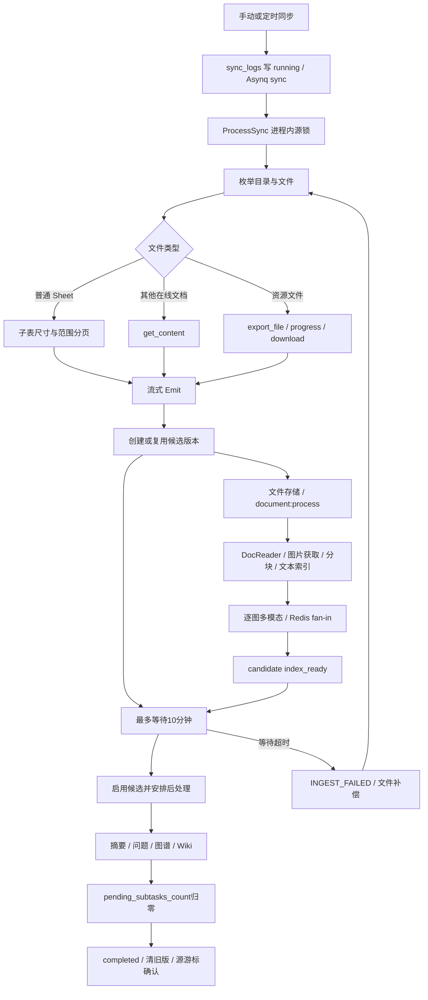

# 腾讯文档同步与文档生命周期复审

状态：设计前复审，2026-09-10。代码基线 `dab6feaee7f62292ddbd2c5b3d9a897ba569e626`，上游 v0.7.2，主项目分支 `weknora-v0.7.2`。

**结论：当前实现已有重要的数据保护，但没有可恢复的完整执行账本。** 同步处理器等待异步解析完成，超时后又以文件为单位补偿；不同系统分别记录状态，无法可靠区分仍在执行、未投递、阶段失败、候选待发布和已恢复历史异常。需要重构状态与调度的关系，而不是继续增加失败字符串匹配。

目标方案见[生命周期重设计](2026-09-10-tencent-sync-lifecycle.md)。本文“确认”指源码或已记录实测支持；并发后果若没有运行复现，会明确标注为时序推导。

## 1. 复审范围与证据边界

- 腾讯连接器：目录/个人文档枚举、文件类型路由、普通 Sheet 分页、MCP 传输、导出、大小限制、文件补偿。
- WeKnora：源版本候选、文件存储、解析、图片获取、分块、文本与图像索引、摘要/问题/图谱/Wiki、发布、旧版本回收、启动恢复与 housekeeping。
- 观测：同步日志、processing spans、Redis fan-in、持久待办/死信、Grafana SQL、Prometheus 指标/告警、Loki 日志关联。
- 历史证据：8/27，9/1、9/2、9/4、9/6、9/7、9/9—10 的发布记录及工作区复核报告。不是只检查 MDX/SmartSheet。

只读核实的生产标识：app `marvel/weknora-app:v0.7.2-reviewed-sync-20260907`；frontend `marvel/weknora-ui:v0.7.2-sync-safe-reset-20260906`。未声称镜像二进制与上述 Git 提交在本轮重新做过逐字节比较。

当前 Grafana 挂载文件来自 `/public/knowledgebase/observability/grafana/dashboards/knowledgebase-overview.json`：UID `mwe-kb-observability-v1`，26 面板，文件 version=15；仓库文件 version=13，**其余解析后内容完全相同**。未读取 Grafana 凭证，未核实 live API 的独立 version。挂载文件 SHA-256：`0432f2d6ee5d7cdf9a8dd222deb7e7774532c199c923517544eaf0c76f964fb1`。

app/frontend/docreader 的 `MAX_FILE_SIZE_MB` 均只读查到 200；腾讯导出自身硬限制为 100 MiB。设计不得把二者混为一个已统一的限额。

## 2. 当前真实架构

入口和写入位置：

| 内容 | 当前实现 |
|---|---|
| 调度、流式 Emit、结果汇总 | [datasource_service.go](../../../internal/application/service/datasource_service.go) `ProcessSync`、`streamSyncHandler.Emit`、`processSyncStreaming` |
| 候选与两个等待阶段 | [datasource_candidate.go](../../../internal/application/service/datasource_candidate.go) `ingestTencentCandidate` |
| 普通 Sheet / 通用正文 | [sheet.go](../../../internal/datasource/connector/tencentdocs/sheet.go)、[client_mcp.go](../../../internal/datasource/connector/tencentdocs/client_mcp.go) |
| 文件补偿与源串行 | [file_retry.go](../../../internal/datasource/connector/tencentdocs/file_retry.go)、[datasource_file_retry.go](../../../internal/application/service/datasource_file_retry.go) |
| 核心解析与整份重解析 | [knowledge_process.go](../../../internal/application/service/knowledge_process.go) `ProcessDocument`、`processChunks`、`ReparseKnowledge` |
| 图片和后处理 | [image_multimodal.go](../../../internal/application/service/image_multimodal.go)、[knowledge_post_process.go](../../../internal/application/service/knowledge_post_process.go) |

候选**核心索引和图片阶段完成后即可启用**，随后才处理共享派生内容，最后清旧版。不能把当前代码描述成“所有富化成功后才发布”。当前该顺序是为避免未发布候选改写共享 Wiki/graph。

## 3. 历史问题账本

| 编号 | 已发生问题 | 当前已有修复 / 尚存问题 | 重设计约束 |
|---|---|---|---|
| H01 | 普通 Sheet 通用读取约100行截断却同步成功 | 已改完整范围分页 | 页数/行列/字段/ID可核对，不能依靠非空正文判断完整 |
| H02 | 170项中73失败；64次429；目录不全还误报97删除 | 临时重试、禁止不完整扫描删除检测已修 | 目录任务独立；完整扫描屏障；凭证级限流 |
| H03 | MinerU容器healthy但CUDA不可用，核心并发与解析容量不匹配 | 已修恢复和回退；能力仍须独立检测 | 资源准入、能力等待与业务失败区分；记录实际解析引擎和回退质量 |
| H04 | housekeeping清零计数，122份已ready仍永久failed | 保留计数与受限迟到完成收敛已修 | 不靠墙钟和可丢计数确定终态 |
| H05 | 全零占位覆盖A1或后页越界 | 精确占位过滤已修；真实0/false须保留 | 坐标协议、空页、稀疏值和公式语义都要保留 |
| H06 | 超100MiB混成解析故障，大小不明 | 已有明确分类、Content-Length和limit+1保护 | 主体、累计页、媒体、展开后大小分别受限；已知值与下界区分 |
| H07 | code111、400001被误当权限或类型问题 | 111保守人工核查；部分资源元数据拒绝仍可导出 | 按工具+阶段+错误码分类，不以单接口失败推断文件不存在 |
| H08 | 旧日志只有标题；同名文件和目录混算 | 新错误有稳定ID，旧记录仍不可精确补建 | 不按标题恢复身份；原始错误追加消解事件，不删除证据 |
| H09 | 导出开始超时无法知道是否已创建任务 | 已保存开始意图、任务ID、不确定状态；6个历史案例受阻 | 不重放结果不确定的非幂等请求；提供核查/人工恢复路径 |
| H10 | 先删旧版、入队失败被当成功、V2导出却确认V3 | 候选保护、入队检查、导出版本绑定已修 | 保留版本保护，产物与输入修订绑定，发布和回收可重试 |
| H11 | 图片重复fan-in/未入队槽位导致错误完成；FAQ发布越过配置变化 | 已补部分图片幂等、失败标记、范围复查 | 所有阶段统一代次与执行单元；不能只检查总数归零 |
| H12 | 重启把仍active的源任务标failed | 当前启动清理仍按30分钟阈值判断 | 重启不直接终结，依据租约和确定事实接续 |
| H13 | 4份等待超时后完成仍列失败；1份ready候选未发布 | 当前残留 | 等待超时不等于工作失败；发布为独立持久阶段 |
| H14 | 主源任务deadletter但日志running，8文件scheduled过期未执行 | 当前残留 | 调度意图、已投递、实际运行分开；死信独立可见 |
| H15 | SmartSheet有记录而通用读取空；MDX图片与原生组件丢失 | 原生适配未完成；9/10有两份SmartSheet通用内容已恢复完整 | 严格完整性门槛，不能笼统宣称一种接口永远成功或永远失败 |

仓库历史来源：[8/27 Sheet](../releases/2026-08-27-tencent-docs-sheet-pagination.md)、[9/1 弹性](../releases/2026-09-01-ingestion-resilience.md)、[9/2 对账](../releases/2026-09-02-housekeeping-state-reconciliation.md)、[9/4 占位](../releases/2026-09-04-sheet-empty-placeholder-ablation.md)、[9/4 大小](../releases/2026-09-04-file-size-and-sync-failure-observability.md)、[9/4 补偿](../releases/2026-09-04-file-compensation-retry.md)、[9/6 候选保护](../releases/2026-09-06-sync-safety-password-reset.md)、[9/6 追加复审](../releases/2026-09-06-prepush-review-and-publish.md)。

9/7—10 原始证据位于项目工作区 `results/failure-review-20260907/`、`results/failure-review-20260909-onward/`、`results/native-format-compatibility-20260910/`；本轮环境与接口核查位于 `results/sync-lifecycle-design-review-20260910/`。这些工作区路径不是仓库已发布附件。

## 4. 当前代码的关键缺口

### R01：补偿粒度仍是整份文件

确认：[候选重试](../../../internal/application/service/datasource_candidate.go#L58) 对失败统一调用 [ReparseKnowledge](../../../internal/application/service/knowledge_process.go#L2520)，先清候选的分块/索引再重新解析；源补偿还会重新抓取。摘要、单张图片、某批embedding、发布或清理失败，没有各自产物和独立执行记录。

### R02：10分钟等待与真实任务预算冲突

确认：[同一 waitCtx](../../../internal/application/service/datasource_candidate.go#L80) 覆盖核心与富化两个等待；底层图像/摘要任务的超时可为30分钟。等待超时只终止同步处理器等待，不代表底层任务失败。H13已实际发生。

### R03：代次不完整，旧回调可能污染新处理

确认：初次 [DocumentProcessPayload](../../../internal/application/service/knowledge_create.go#L226) 未固定 Attempt；worker 对缺省值开新轮次；[NextAttempt](../../../internal/application/repository/knowledge_span_repo.go#L107) 用 MAX+1 非原子分配。[核心处理](../../../internal/application/service/knowledge_process.go#L3195) 和 [dead-letter回写](../../../internal/router/task.go#L414) 缺少完整代次CAS；部分富化只在入口检查。

“旧worker迟到后覆盖新轮次”是代码可达的并发时序风险，本轮没有在生产触发该竞态。阶段提交必须检查作业代次、阶段尝试和租约；外部索引还需隔离写入，单靠DB CAS不够。

### R04：计划、投递与fan-in之间有崩溃窗口

确认：[processChunks](../../../internal/application/service/knowledge_process.go#L669) 部分enqueue错误只日志；图片先设置Redis计划数，再逐个enqueue；后处理seed计数后逐项投递，重入可能跳过未发任务。[FinalizeSubtask](../../../internal/application/repository/knowledge.go#L608) 仅按knowledge_id减计数，没有所有富化统一的任务槽位去重。

Wiki已有事务seed+outbox和 [ClaimBatch](../../../internal/application/repository/task_queue.go#L222)，[wiki_ingest](../../../internal/application/service/wiki_ingest.go#L837) 实际使用；`TaskPendingOp.ClaimedAt` 的“未使用”注释已过时。本方案复用已存在能力，不能把它误判为缺失。

### R05：业务失败可能返回队列成功；资产缺失只记warning

确认：部分分块/BatchIndex错误写failed后从void函数返回，外层可能返回nil；死信/Asynq重试看不到这类失败。图片下载/识别部分错误和超过预算会跳过，缺少完整失败清单。[图片上限](../../../internal/infrastructure/docparser/image_resolver.go#L623) 当前每张10MiB、每个语法扫描最多30张；48张图片的文档即使原生转换正确，也不能容许余下图片静默丢失。

### R06：状态写入或观测失败会被误当事实

确认：[同步结果](../../../internal/application/service/datasource_service.go#L1202) 在已取消ctx上写入，失败仅日志；源/KB数据库查询异常可能被当作已删除取消。[housekeeping](../../../internal/application/service/knowledge_housekeeping.go#L245) 和队列探测失败可被折叠成无活任务；最终更新也未完整复查代次/更新时间。新逻辑必须保留 `observation_unknown`，不能据此宣判失败。

### R07：当前追踪不能直接作为可靠调度账本

[SpanTracker](../../../internal/application/service/knowledge_span_tracker.go#L22) 明确为best-effort；Redis图片计数有24小时TTL；source cursor是源级快照；[sync_logs](../../../internal/types/datasource.go#L146) 把scheduled/active混为running，errors最多100条。源重投重新累计还会覆盖旧进度。需要持久化逐项记录；现有这些字段改作兼容投影或诊断信息。

### R08：Dashboard同时存在误报、漏报和关联不准确

- [document_failures.sql](../../../deploy/mwe-observability/grafana/queries/document_failures.sql#L45) 以created_at/source_fetch_completed_at消解失败，漏掉同尝试迟到完成；历史failed span未严格限定当前代次；max(UUID)不能保证关联同一次错误。
- 死信面板依赖源最新日志failed/partial，running恰好被排除；source最新success也不能证明每个旧文件失败已恢复。
- [指标](../../../deploy/mwe-observability/alloy/weknora-queries.yml) 的失败计数混用updated_at，长时间running可能被24小时窗口隐藏。
- [Loki采集](../../../deploy/mwe-observability/alloy/config.alloy) 缺少贯通run/job/step/attempt关联；当前错误正则不足以覆盖等待/导出/投递异常。
- 现有[查询生成器](../../../scripts/render-observability-failure-queries.py)统一了部分明细和计数，这是正确修复；跨页仍需稳定快照，死信也应共享投影。

## 5. 原生读取新证据与能力边界

1. 有效SmartCanvas长文档352个顶层子节点、18次分页，352/352 ID覆盖；48个原生图片地址均未进入通用正文。7个代码块仅返回`Unsupported type=code`。不能承诺单独改用MDX接口即完整。
2. SmartSheet两份样本119行/1,071显示值、13行/91显示值逐行列通过；另一份10行/80显示值通用结果为空。计算引用列必须显式取回；默认原生读取会省略计算值。
3. 本轮普通DOC样本metadata正常，但`doc.resolve_document_structure`返回60007无权限。它是能力/权限边界，不是文档格式损坏。没有尝试扩权或用其他凭证绕过。
4. 本机旧DOC参考把`mode`写作字符串且preview上限200，当前工具schema要求数值0/1/2；结构详情的`full`并不等价于正文无截断。适配必须固定已验收的工具契约，并校验完整正文来源，不能把preview当全文。

## 6. 保留项与本轮交付性质

保留：100MiB腾讯主体限制、SSRF/下载域名与重定向保护、分钟级错误退避、租户与选定范围检查、源相对目录、FAQ标准问append/merge、源删除不自动删除知识、候选先保留旧版、未发布候选不改共享派生内容、已实现的Wiki事务待办和队列独立池。

本轮交付为复审与可执行验证的设计契约。没有修改生产调度或升级数据库；并发反例、接口能力限制和迁移门槛在目标设计中明确列出。中文为本次内部设计的唯一维护版本，未同步改写上游多语言用户文档。
